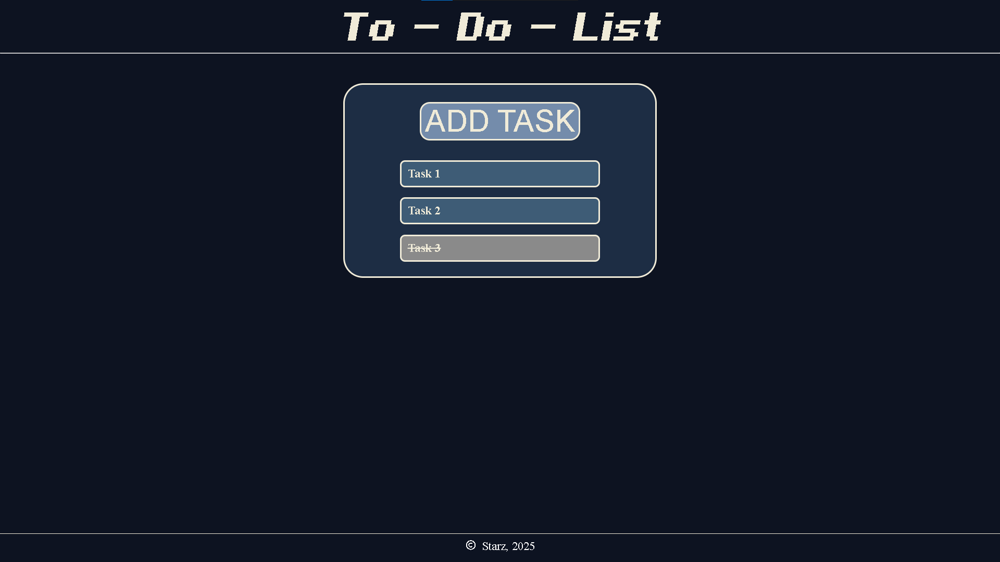
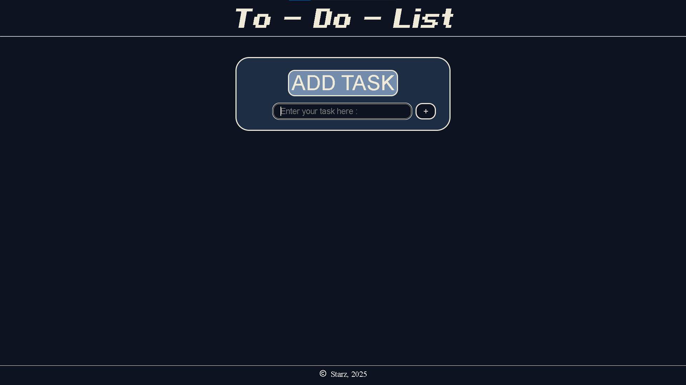
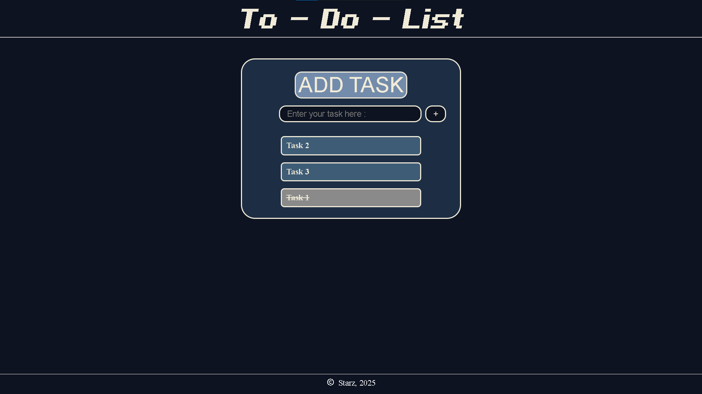
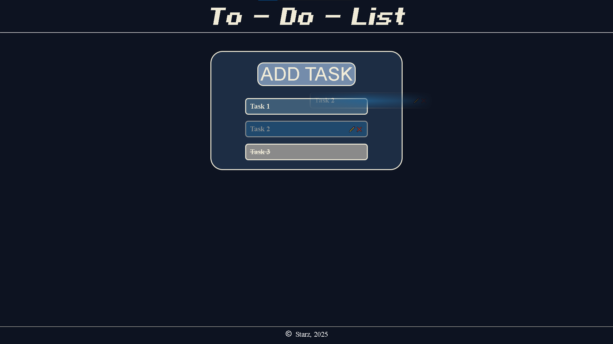

# To-Do List Web App

## 📌 About the Project

This is an interactive **To-Do List Web App** that helps users manage their tasks efficiently. The app allows users to add, delete, and mark tasks as completed, making task management simple and organized.

## 🚀 Features

- 📝 Add new tasks to your list
- ✅ Mark tasks as completed
- ❌ Delete tasks when no longer needed
- 🔄 Reorder tasks
- 📌 User-friendly interface
- 🎨 Simple and clean UI

## 🛠️ Technologies Used

- **HTML** – Structure of the web page
- **CSS** – Styling and layout
- **JavaScript** – Interactive functionality

## 📂 Project Structure

## 📸 Screenshots

- 
- 
- 
- 
- 

## 🎯 How to Use

1. Clone this repository:
2. Open `index.html` in your browser.
3. Start adding tasks, marking them as done, or deleting them when needed.

## 💡 Future Enhancements

- 🏷️ Add categories for tasks
- 🎨 Implement dark mode
- 📅 Add due dates and reminders
- 🔄 Save tasks using local storage or backend integration

## 🤝 Contributing

Contributions are welcome! If you find any issues or have suggestions, feel free to open an issue or submit a pull request.

## 📜 License

This project is open-source and available under the [MIT License](LICENSE).

## 📬 Contact

For any queries or collaboration, feel free to reach out:

- **GitHub**: [Starz099](https://github.com/Starz099)
- **Email**: *[mayankjod016@gmail.com](mailto\:mayankjod016@gmail.com)*